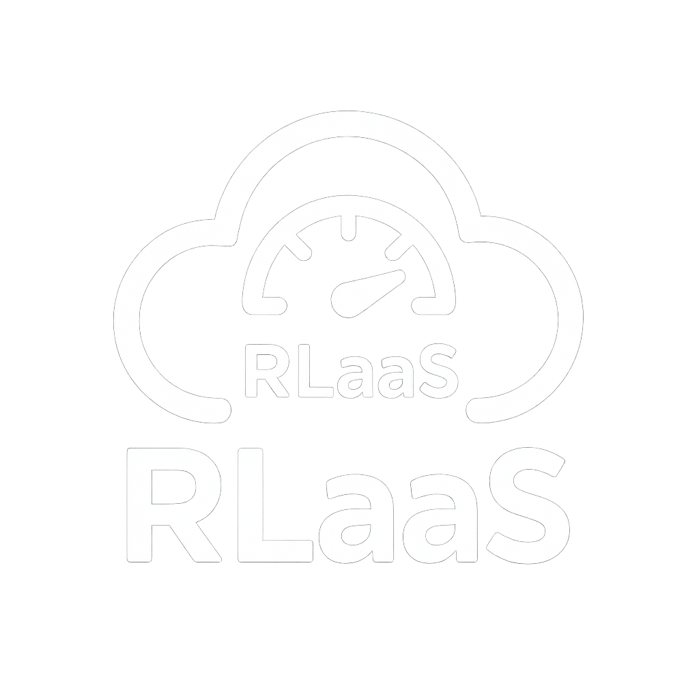
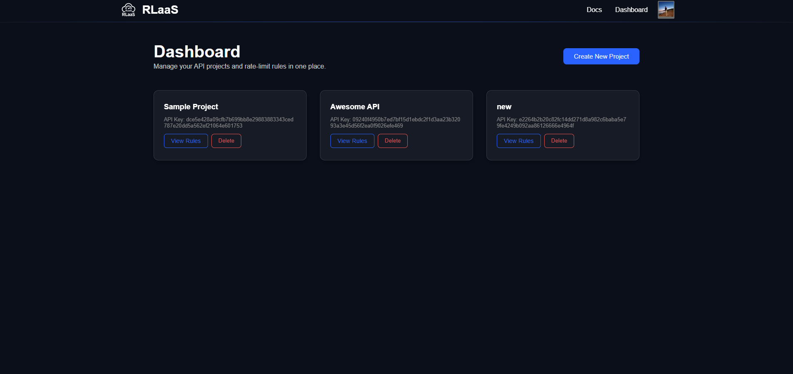
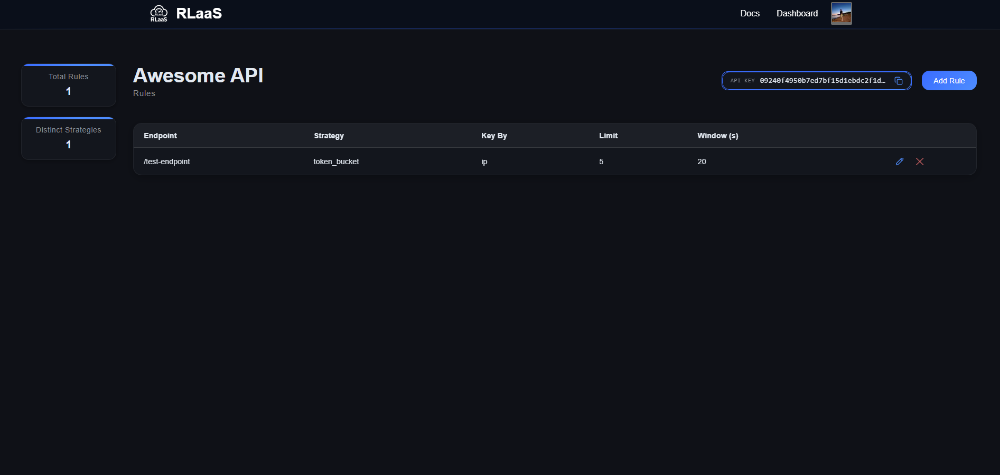
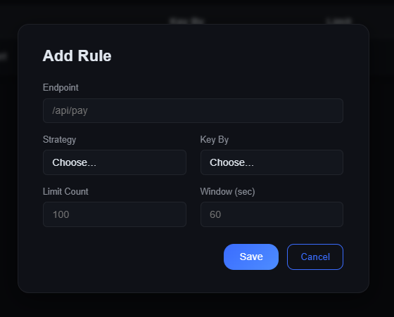

<p align="center">
  
</p>

<h1 align="center">RLaaS Frontend</h1>
<p align="center"><em>Modern dashboard for scalable API rate limiting — built with Next.js 15 and React 19</em></p>

<p align="center">
  <a href="https://github.com/AliRizaAynaci/rlaas"></a>
  <a href="LICENSE"></a>
</p>

---

> **Note:** This is the frontend for [RLaaS](https://github.com/AliRizaAynaci/rlaas), a backend service that handles API key management and rate limiting. Use both together for a complete solution.

---

## 📦 Features

* 🔐 **API Key Management** – create, revoke, and copy keys easily.
* ⚙️ **Live Rule Editing** – adjust rate limits instantly without downtime.
* 🧩 **Multiple Strategies** – Token Bucket, Sliding Window, Fixed Window, Leaky Bucket.
* 🛡 **Google OAuth Login** – simple and secure access.
* 🧠 **Multi-Tenant Architecture** – separate projects per user.
* 📱 **Responsive Interface** – clean UX powered by React Server Components.

---

## 🧱 Architecture

```text
┌────────────┐         OAuth2        ┌──────────────┐
│  Browser   │ ───────────────────▶ │ Google IdP   │
└────┬───────┘                      └──────────────┘
     │ REST / JSON                            ▲
     ▼                                        │
┌────────────────────────────┐  Redis / HTTP  │
│  RLaaS Frontend (Next.js)  │ ◀──────────────┤
└────────────────────────────┘     RLaaS Go Backend
```

---

## 🚀 Getting Started

```bash
# 1. Clone the frontend
git clone https://github.com/AliRizaAynaci/rlaas-frontend.git
cd rlaas-frontend && npm ci
npm run dev  # http://localhost:3000
```

```bash
# 2. In a new shell, run the backend
git clone https://github.com/AliRizaAynaci/rlaas.git
cd rlaas && make run  # or docker-compose up -d
```

The frontend expects the backend at `http://localhost:8080`. If different, update `src/lib/api.js`.

---

## 🏗️ Project Structure

```text
src/
├─ app/          # App Router pages (dashboard, rules, projects)
├─ components/   # Shared UI components (Navbar, Buttons, etc.)
├─ context/      # Global state (AuthContext, ToastContext)
└─ public/       # Static files (logo, icons, etc.)
```

---

## 🧩 Tech Stack

| Layer      | Tech                       | Purpose                               |
| ---------- | -------------------------- | ------------------------------------- |
| Framework  | Next.js 15 (App Router)    | Hybrid SSR/SSG with RSC support       |
| UI Layer   | React 19 + Suspense        | Async transitions and concurrency     |
| Styling    | CSS Modules + PostCSS      | Component-scoped styles               |
| Icons      | Lucide React               | Feather-style icon system             |
| State Mgmt | React Context (Auth/Toast) | Lightweight, global state             |
| Auth       | Google OAuth2              | Secure login + multi-tenant isolation |

---

## 📸 Screenshots

### 🏠 Home Page


### 📊 Dashboard



### 📁 Rules Page



### ➕ Add New Rule



---

## 🤝 Contributing

1. Fork the repo and create a new branch:

   ```bash
   git checkout -b feat/my-feature
   ```
2. Use [Conventional Commits](https://www.conventionalcommits.org/) for clear commit history:

   ```bash
   git commit -m "feat: add dark mode support"
   ```
3. Push and open a Pull Request.

---

## 📄 License

This project is licensed under the [MIT License](./LICENSE).
